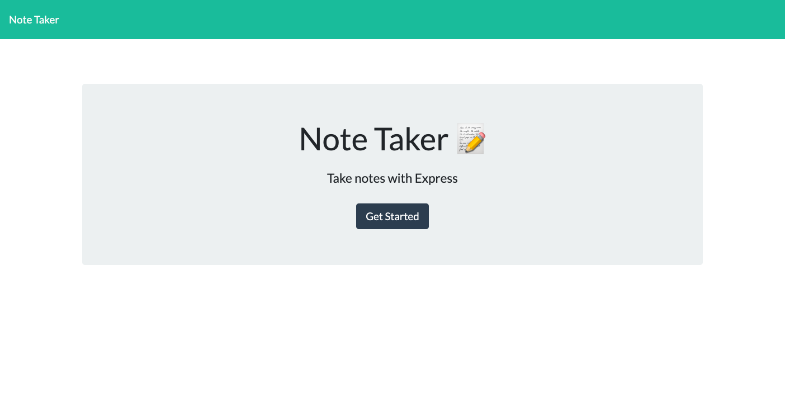
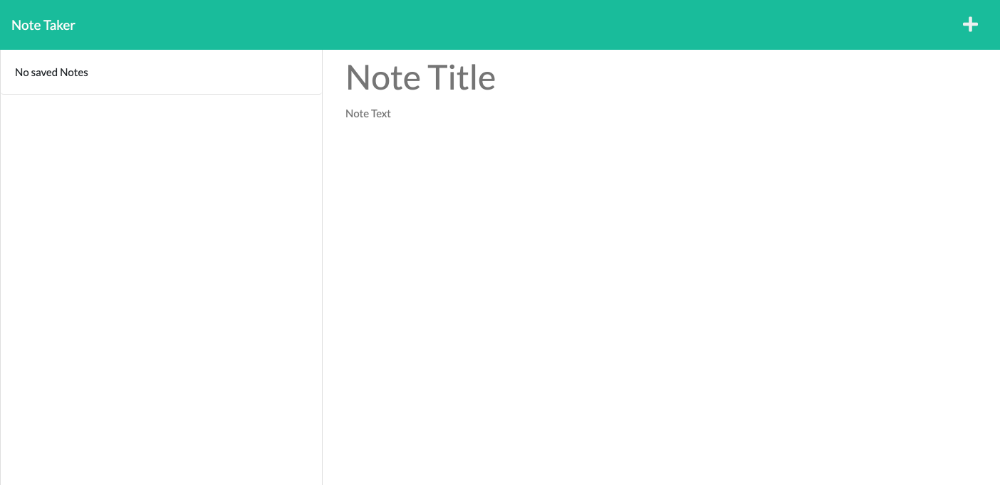
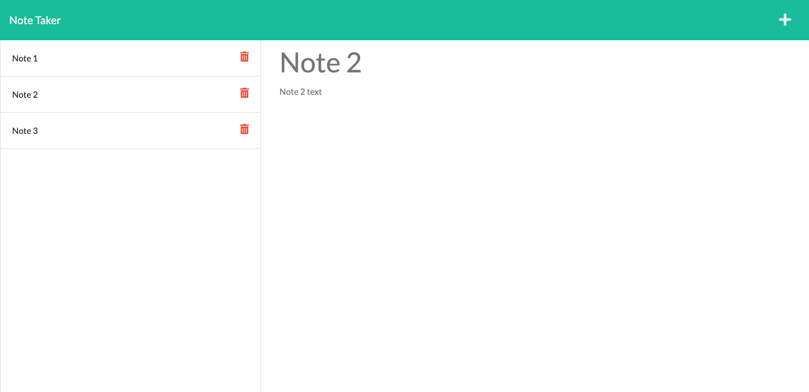

Homework 11 - Note Taker
  
 

  ## Description 
  This project is a note taker application. Users can enter notes with a title and note text and then click the save button. Once the save button has been clicked, the note will be stored in a json file within the application. Since the notes are saved to a json file, you can open the application from anywhere and see the notes that you saved. If you click the delete button, it will delete the note from the json file. 

  ## Table of Contents
  
  * [Installation](#installation)
  * [Usage](#usage)
  * [License](#license)
  * [Contributing](#contributing)
  * [Tests](#tests)
  * [Questions](#questions)
  * [Links](#links)
  * [Pictures](#pictures)

  ## Installation
  To install the necessary dependencies, run the following command:
  npm i

  ## Usage
  Repo instructions: Once all of the dependencies have been installed, run "node server.js" from the terminal and it will start the application server

  ## License
  This project doesn't have a license.

  ## Contributing 
  Contributing is not allowed at this time.

  ## Tests 
  There are no tests at this time.

  ## Questions
  If you have any questions about the repo, reach out to me directly at katie.wine2@gmail.com. See more of my work at https://www.github.com/kmwine02

  ## Links
  The application can be found here: https://kmwine02-homework11-note-taker.herokuapp.com/
  The repo can be found here: https://github.com/kmwine02/homework11-note-taker

  ## Pictures
  View of the homepage of the application:
  
  View of the notes page of the application:
  
  View of sample notes in the application:
  
